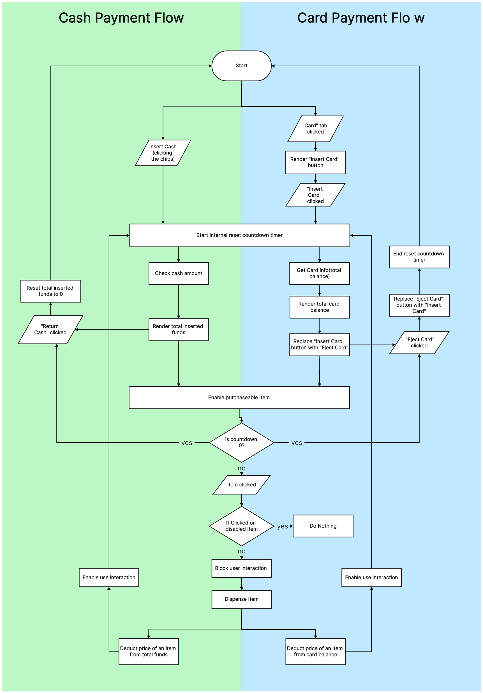
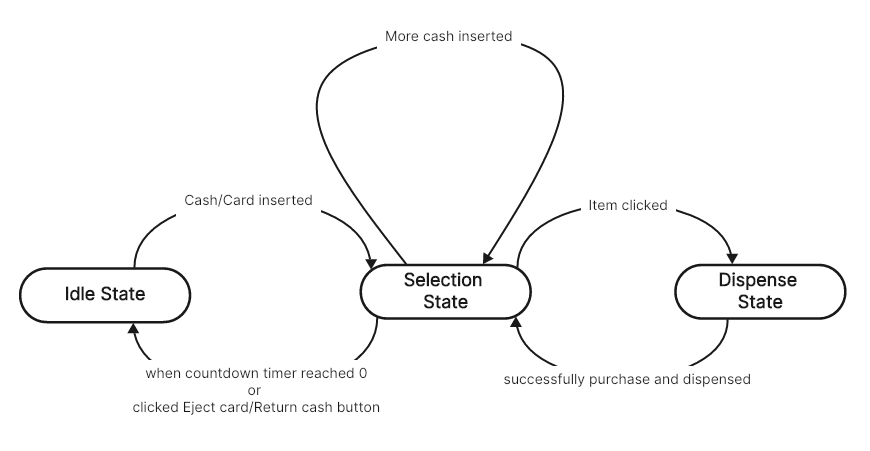

# Jaylee Vending Machine

    

<a href="https://jhleeweb.github.io/jaylee-vending-machine/">
 JayLee-Vending-Machine Github Page
</a>

## 소개

안녕하세요. 이중훈 자판기 입니다.

자판기 종류도 많을 뿐만 아니라 작동 방식도 모두 재각각인데요. 요구조건을 모두 지키며 그 외 발생할 수 있는 예외 상황, 디자인 요소 그리고 제가 만든 자판기가 어떤식으로 동작하는지 좀 더 쉽게 파악할 수 있도록 몇몇 기능을 추가했습니다.

이 readme를 통해 repository 실행 방법, 상세설명, 사용한 라이브러리 등 어떤식으로 기획했고, 어떤식으로 구현해 냈는지 설명하도록 하겠습니다.

## 개요

- [**배경**](#배경)
- [**설치방법**](#설치방법)
- [**라이브러리**](#라이브러리)
- [**상세내용**](#배경)
  - [**메카니즘**](#마카니즘)
  - [**상태**](#상태)
  - [**상태관리**](#상태관리)

## 설치방법

`node.js` 버전 20 이상 권장합니다.

```
npm install
npm run dev
```

## 라이브러리

#### UI/UX

 

높을 퀄러티로 빨리 개발하기 위해 HeroUI를 사용해 개발해습니다. HeroUI는 Tailwindcss를 기반으로 만들져 Tailwindcss의 작은 번들 사이즈, 성능 개선 등등의 장점도 같이 얻을 수 있다고 판단되어 최근에 자주 사용하고 있습니다.

#### Framework

 

기존에는 Webpack통해 리엑트 어플리케이션을 번들링했지만, Vite는 Rollup기반으로 번들링하여 개발하는데 있어 편리하여 사용했습니다. 개인적으로 CRA는 너무 커진 느낌인 반면에 Vite는 훨씬 가볍습니다.

#### 기타


능숙하게 활용은 못하지만, 타입 추론으로 개발에 편리하고 컴파일 단계에서 타입 오류로 미리 오류를 피할 수 있어 디버깅 할때도 많은 도움을 받고 있습니다. 너무 `any`나 `unknown`을 난무하지 않는다면 코드의 안정성을 향상 시킬 수 있다고 판단하여 사용했습니다.

# 상세 내용

## 메카니즘 다이어그램

기본 기능은 같지만 결제 방식(현금/카드)에 따라 내부 처리가 크기 달라져 이런 식으로 다이어그램을 그렸습니다.



제 자판기는 `idle`, `selection`, `dispense` 상태에 따라 동작합니다.

```typescript
//idle: 대기상태
//selection: 제품 선택 상태
//dispense: 제품 배분 및 결제
type StateType = 'idle' | 'selection' | 'dispense';
```

## 상태 전환 다이어그램



### idle 상태

idle 상태 일 경우에는 사용자 입력만을 기다립니다. 자판기에 넣은 급액이 없을 경우 모든 제품은 비활성화 됩니다.

### selection

selection 상태로 전환과 동시에 초기화 타이머의 카운트 다움이 시작됩니다.
현재 넣은 금액에 따라 구매 가능한 제품만 활성화가 됩니다. 제품을 선택하면 제품이 바로 배분되며, dispense상태로 전환됩니다.

### dispense

dispense단계에서는 제품이 배분되고 결제 금액 만큼 차감되기 전까진 다른 사용자 인터렉션을 차단합니다.

### 상태 관리

저는 다음과 같은 이유로 `React`의 `Context`를 사용했습니다.

- Prop drilling 최소화

  - 여러 컴포넌트가 공유하는 상태이기 때문에 props drilling을 피하기 어려울거라 판단했습니다. Context로 이 문제를 쉽게 해결 할 수 있습니다.

- 코드 가독성

  - Context로 props drilling이 해결되면 코드가 간결해져 코드 가독성을 높힙니다.

- 사용성

  - 초기 Provider만 세팅해주면 useContext()훅을 사용해 깊이와 상관없이 Provider 하위 컴포넌트에서는 상태를 자유롭게 접근이 가능합니다.

- 외부 라이브러리 의존성

  - 리엑트에 포함된 API로 다른 전역 상태 관리 라이브러리가 필요 없습니다.

- 불필요한 상태
  - Provider 위치에 따라 해당 상태 제공 범위를 조절할 수 있어 상태가 간결해 집니다.

```typescript
//VendingMachine 컴포넌트에서만 사용 될 로컬 컨텍스트입니다.
export const ContextProvider = ({ children }: ContextProviderProps) => {
	const [machineState, setMachineState] = useState<MachineState>({
		state: 'idle',
		funds: 0,
	});

	const value = {
		machineState, //자판기 상태입니다.
		setMachineState, //상태 transition울 위해 setter함수도 같이 전달했습니다.
	};

	//자식 컴포넌트에서 useContext() 훅을 활용해 value 값에 접근하기 때문에 Provider만 반환합니다.
	return (
		<StateContext.Provider value={value}>{children}</StateContext.Provider>
	);
};
```
