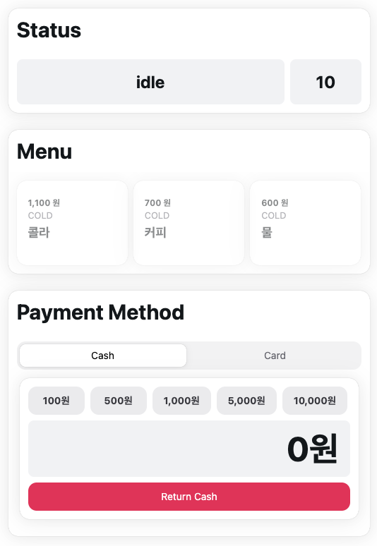

# Jaylee Vending Machine




현금 및 카드 결제가 가능한 자판기 입니다.

<a href="https://jhleeweb.github.io/jaylee-vending-machine/">
 JayLee-Vending-Machine Github Page
</a>

## 설치

`node.js` 버전 20 이상 권장합니다.

```
npm install
npm run dev
```

## 라이브러리

#### UI/UX


높을 퀄러티로 빨리 개발하기 위해 HeroUI를 사용해 개발해습니다. HeroUI는 Tailwindcss를 기반으로 만들져 Tailwindcss의 작은 번들 사이즈, 성능 개선 등등의 장점도 같이 얻을 수 있다고 판단되어 최근에 자주 사용하고 있습니다.

#### Framework


기존에는 Webpack통해 리엑트 어플리케이션을 번들링했지만, Vite는 Rollup기반으로 번들링하여 개발하는데 있어 편리하여 사용했습니다. 개인적으로 CRA는 너무 커진 느낌인 반면에 Vite는 훨씬 가볍습니다.

#### 기타


능숙하게 활용은 못하지만, 타입 추론으로 개발에 편리하고 컴파일 단계에서 타입 오류로 미리 오류를 피할 수 있어 디버깅 할때도 많은 도움을 받고 있습니다. 너무 `any`나 `unknown`을 난무하지 않는다면 코드의 안정성을 향상 시킬 수 있다고 판단하여 사용했습니다.

## 상세 내용

### 기본 로직 다이어그램

기본 기능은 같지만 결제 방식(현금/카드)에 따라 내부 처리가 크기 달라져 이런 식으로 다이어그램을 그렸습니다.


제 자판기는 `idle`, `selection`, `dispense` 상태에 따라 동작합니다.

```typescript
//idle: 대기상태
//selection: 제품 선택 상태
//dispense: 제품 배분 및 결제
type StateType = 'idle' | 'selection' | 'dispense';
```

### 상태 전환 다이어그램


커스텀 context provider를 만들어 기획 된 자판기 작동에 필요한 상태들은 자식 컴포넌트에 전달했습니다. 자식 컴포넌트에서는 `useContext()`훅을 활용하여 상태에 접근했습니다.

### 상태 관리

```typescript
//VendingMachine 컴포넌트에서만 사용 될 로컬 컨텍스트입니다.
export const ContextProvider = ({ children }: ContextProviderProps) => {
	const [machineState, setMachineState] = useState<MachineState>({
		state: 'idle',
		funds: 0,
	});

	const value = {
		machineState, //자판기 상태입니다.
		setMachineState, //상태 transition울 위해 setter함수도 같이 전달했습니다.
	};

	//자식 컴포넌트에서 useContext() 훅을 활용해 value 값에 접근하기 때문에 Provider만 반환합니다.
	return (
		<StateContext.Provider value={value}>{children}</StateContext.Provider>
	);
};
```
