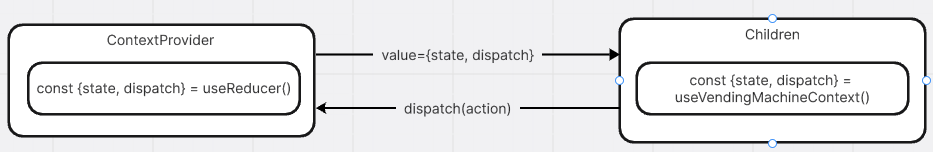

# Jaylee Vending Machine

    

<a href="https://jhleeweb.github.io/jaylee-vending-machine/">
 JayLee-Vending-Machine Github Page
</a>

## 목차
- [**목차**](##목차)
- [**소개**](##소개)
- [**설치 방법**](##설치-방법)
- [**라이브러리**](##라이브러리)
  - [**UI**](####UI)
- [**동작 방식**](##동작-방식)
- [**주요 로직**](##주요-로직)
- [**예외 케이스 처리**](##예외-케이스-처리)

## 소개

안녕하세요. 이중훈 자판기 입니다.

자판기 종류도 많을 뿐만 아니라 작동 방식도 모두 재각각인데요. 요구조건을 모두 지키며 그 외 발생할 수 있는 예외 상황, 디자인 요소 그리고 제가 만든 자판기가 어떤식으로 동작하는지 좀 더 쉽게 파악할 수 있도록 몇몇 기능을 추가했습니다.

이 readme를 통해 repository 실행 방법, 상세설명, 사용한 라이브러리 등 어떤식으로 기획했고, 어떤식으로 구현해 냈는지 설명하도록 하겠습니다.

## 설치 방법

`node.js` 버전 20 이상 권장합니다.

```
npm install
npm run dev
```

## 라이브러리

#### UI

 

높을 퀄러티로 빨리 개발하기 위해 HeroUI를 사용해 개발해습니다. HeroUI는 Tailwindcss를 기반으로 만들져 Tailwindcss의 작은 번들 사이즈, 성능 개선 등등의 장점도 같이 얻을 수 있다고 판단되어 최근에 자주 사용하고 있습니다.

#### Framework

 

기존에는 Webpack통해 리엑트 어플리케이션을 번들링했지만, Vite는 Rollup기반으로 번들링하여 개발하는데 있어 편리하여 사용했습니다. 개인적으로 CRA는 너무 커진 느낌인 반면에 Vite는 훨씬 가볍습니다.

#### 기타


능숙하게 활용은 못하지만, 타입 추론으로 개발에 편리하고 컴파일 단계에서 타입 오류로 미리 오류를 피할 수 있어 디버깅 할때도 많은 도움을 받고 있습니다. 너무 `any`나 `unknown`을 난무하지 않는다면 코드의 안정성을 향상 시킬 수 있다고 판단하여 사용했습니다.

## 동작 방식


*사용자 흐름 다이어그램*, *상세 흐름 다이어그램*

자판기는 간단한 로직으로 작동합니다. 자판기는 기본적으로 사용자 입력이 있기 전까지는 idle상태를 유지합니다.
돈을 넣게 되면 구매 가능한 제품이 활성화되며 구매 가능해 집니다. 자판기는 이 부분을 selection 상태에서 진행됩니다.
selection 상태에서는 초기화 제한시간(10초)이 있으며, 초과 할 경우 넣은 돈은 모두 반환되고 idle상태로 돌아가게 됩니다.

# 주요 로직

## 상태 관리



관리해야 할 상태가 많고, 복잡하여 `useReducer()`를 사용하는 것이 가장 적합하다고 판단했습니다. 전역으로 제공되어야 하기 때문에 Context + Reducer를 조합하여 사용하기로 결정했습니다.

`<VendingMachineContextProvider/>` 하위 컴포넌트는 모두 `useVendingMachineContext()` 컴스텀 훅을 통해 상태 값을 전달 받고 수정 명령을 보내도록했습니다..

> **Note**
> (`useVendingMachineContext()`는 `createContext()`함수 선언 시 null 값은 인자로 넘겨주는데, 그럴게 했을 경우 context를 사용하는 모든 컴포넌트에서 null값 예외 처리를 해야하는 번거러움이 있어 커스텀 훅으로 만들어 null값 일 경우 애러를 던지도록 처리하여, 하위 컴포넌트에 유효한 값을 보장합니다.)

## 상태 전이 다이어그램


세가지 상태에 의해 특정 요소 활성화 및 UI를 랜더합니다.

**idle**: 대기 상태에서는 사용자 입력을 기다립니다. 결제 방식 선택 및 현금/카드 삽입을 기다립니다.

**selection**: 카드/현금 입력이 감지되면 제품 선택 상태인 selection상태로 전이 됩니다. 이 상태에서는 제품을 구매하기 위해 필요한 검증 절차(잔액 확인, 카드/현금 뽑기 등등)진행하며 제한 시간 이내에 제품을 선택해야 합니다.

**ignore**: 자판기가 사용자 입력을 무시하는 상태를 뜻합니다. 비동기 요청, 제품 배분등 사용자 입력을 제한 할때 진입하는 상태입니다.

## 예외 케이스 처리

자판기를 구현하면 많은 예외 케이스가 발생합니다. 간단한 기능으로 번거로울 수 있는 예외 케이스를 차단했습니다.

**잔액/재고에 의한 제품 버튼 활성화**

- 잔액이 부족한 상태에서 제품을 뽑으려 했을때
- 재고가 없을때

**돈을 넣었을때 결제 방식 변경 불가능**

- 현금을 넣고, 카드를 넣었을때(반대 일 경우)

**제품을 뽑을때 사용자 입력 차단**

- 제품 배분 및 결제 중 현금/카드를 뺐을때
- 제품 배분 및 결제 중 현금/카드을 넣었을때
- 여러 제품을 동시에 뽑으려 할때
- 제품을 연속으로 눌렀을때
- 재고가 없을때

**대기시간 초과 시 자동 반환**

- 현금/카드를 넣고 아무것도 하지 않을때

**제품을 뽑고 잔액이 남았다면 추가로 제품 뽑기**

- 여러 제품을 뽑고 싶을때
